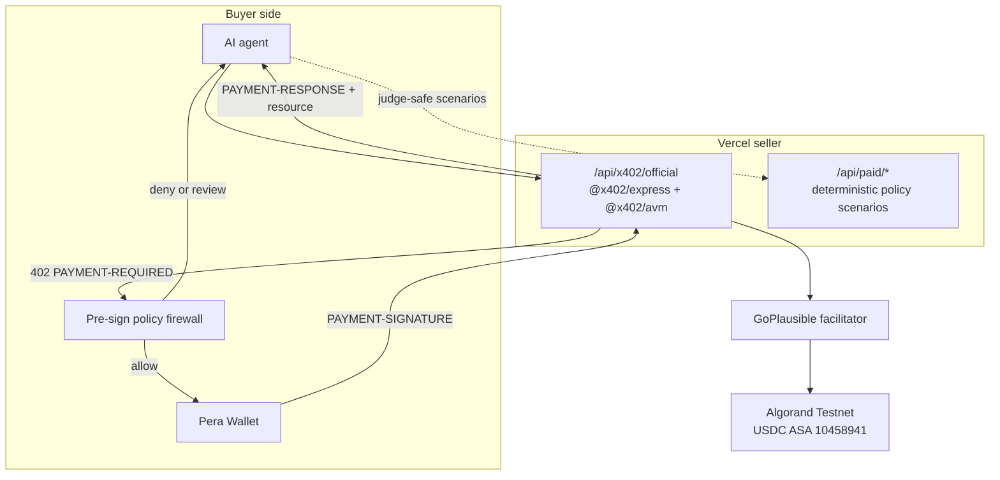

# AgentPay Firewall Architecture

AgentPay Firewall combines a live Algorand x402 seller, a pre-sign policy engine, and wallet-controlled buyer authorization. Protocol proof and deterministic policy scenarios are kept separate so every claim is independently verifiable.

## System Boundary



## Layer A: Algorand x402 Seller

Public endpoint: `https://agentpay-firewall.vercel.app/api/x402/official`

Implementation: [api/x402/official.ts](api/x402/official.ts)

The serverless route constructs:

- `HTTPFacilitatorClient` from `@x402/core/server`
- `x402ResourceServer` and `paymentMiddleware` from `@x402/express`
- `ExactAvmScheme` from `@x402/avm/exact/server`

The middleware generates an x402 v2 challenge with this accepted payment option:

```text
scheme: exact
network: algorand:SGO1GKSzyE7IEPItTxCByw9x8FmnrCDexi9/cOUJOiI=
amount: 1000 atomic units = 0.001 USDC
asset: 10458941
payTo: U3SN2UCQENDGE3CHKPBMXRSNJ2GFCCHLBT7NUC46VSPEGZDMOIQNCHPQJA
facilitator: https://facilitator.goplausible.xyz
```

`npm run smoke:x402` requires HTTP 402, decodes `PAYMENT-REQUIRED`, and asserts protocol version, exact scheme, Algorand network, USDC ASA, amount, receiver, and resource binding.

## Layer B: Pre-Sign Policy Firewall

The policy engine runs after the payment challenge is received and before the buyer wallet signs. It checks service allowlist, per-request limit, daily budget, asset and network, risk score, and human approval threshold.

| Decision | Wallet behavior | Payment behavior |
| --- | --- | --- |
| Allow | Signing may proceed | Client retries the protected resource |
| Deny | Signing is never requested | No authorization exists |
| Review | Signing pauses | A human must approve first |

The `/api/paid/*` routes generate explicitly labeled, offchain demonstration receipts. They are not presented as facilitator or onchain evidence.

## Layer C: Pera Wallet Buyer

Implementation: [src/lib/algorand-wallet.ts](src/lib/algorand-wallet.ts)

The browser buyer requests the protected resource, decodes the challenge, evaluates policy, and uses Pera Wallet to sign the facilitator-provided Algorand transaction group. It then retries with `PAYMENT-SIGNATURE`, decodes `PAYMENT-RESPONSE`, and exposes the returned transaction for Lora inspection.

The private key and mnemonic never enter AgentPay Firewall.

## Compatibility Boundary

The previous Base Sepolia seller is preserved at `/api/x402/base`. It demonstrates that the policy layer can support another x402 network, but the final-round primary route and judging evidence are Algorand-specific.

## Security Properties

- No buyer private key is stored by the app.
- Denied requests never reach wallet signing.
- The payment challenge binds network, asset, amount, receiver, and resource.
- Verification and settlement are delegated to official x402 middleware and GoPlausible.
- Simulation and onchain receipts use distinct labels.
- Server responses use `Cache-Control: no-store` and expose only required x402 headers.

## Production Hardening

A commercial deployment would add durable policy storage, authorization idempotency, replay monitoring, authenticated organizations, account-level limits, and operational alerts.
