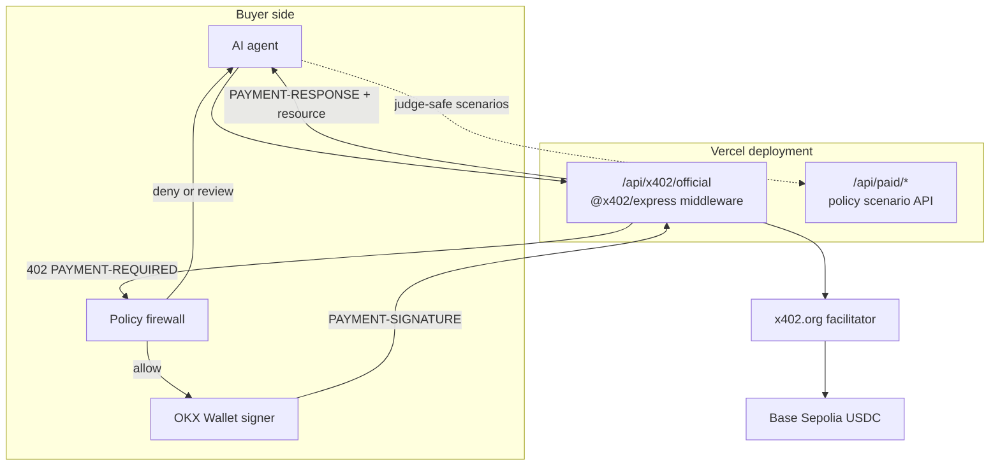

# AgentPay Firewall Architecture

AgentPay Firewall combines a live official x402 seller, a pre-sign policy engine, and wallet-controlled buyer authorization. The public product deliberately separates protocol proof from deterministic policy scenarios so evaluators can tell which path is real x402 and which path is simulation.

## System Boundary



## Layer A: Hosted Official x402 Resource

Public endpoint:

```text
https://agentpay-firewall.vercel.app/api/x402/official
```

Implementation: [api/x402/official.ts](api/x402/official.ts)

The serverless route constructs:

- `HTTPFacilitatorClient` from `@x402/core/server`
- `x402ResourceServer` and `paymentMiddleware` from `@x402/express`
- `ExactEvmScheme` from `@x402/evm/exact/server`

The middleware, not application code, generates the x402 v2 `PAYMENT-REQUIRED` challenge. Its current accepted payment option is:

```text
scheme: exact
network: eip155:84532
amount: 1000 atomic USDC units
payTo: 0x4a6aae28b27681856ae824af82fea87896ecc3ed
facilitator: https://x402.org/facilitator
```

`npm run smoke:x402` fetches the deployed resource, requires HTTP 402, decodes the official header with `@x402/core/http`, and asserts scheme, network, and resource binding.

## Layer B: Pre-Sign Policy Firewall

The policy engine runs after a payment challenge is received and before the buyer wallet is asked to sign. It checks:

- service allowlist
- per-request limit
- daily budget
- asset and network
- risk score
- human approval threshold

Its three outcomes are deterministic:

| Decision | Wallet behavior | Payment behavior |
| --- | --- | --- |
| Allow | Signing may proceed | Client can retry the x402 resource |
| Deny | Signing is never requested | No payment authorization exists |
| Review | Signing pauses | A human must approve first |

The public `/api/paid/*` routes provide stable scenario data for demonstrating these decisions. Their generated receipts are explicitly marked `demo-facilitator` and `onchain: false`; they are not presented as official settlement evidence.

## Layer C: Wallet-Controlled Buyer

Implementation: [src/lib/okx-wallet.ts](src/lib/okx-wallet.ts)

The browser buyer:

1. Requests the official hosted resource.
2. Decodes `PAYMENT-REQUIRED` with the official x402 client APIs.
3. Runs the payment through the policy engine.
4. Builds the exact EVM authorization.
5. Requests `eth_signTypedData_v4` from OKX Wallet.
6. Retries with `PAYMENT-SIGNATURE`.
7. Decodes `PAYMENT-RESPONSE` and links any returned transaction hash to an explorer.

The private key remains inside the wallet extension. AgentPay Firewall receives only the account address and signed authorization.

## Settlement Evidence

A completed official x402 run produced this Base Sepolia settlement:

```text
Payer: 0x0934146ca4f8e611da0ef8bd295ee9f7e34741fe
Pay to: 0x4a6aae28b27681856ae824af82fea87896ecc3ed
Token: USDC at 0x036CbD53842c5426634e7929541eC2318f3dCF7e
Amount: 1000 atomic units = 0.001 USDC
Block: 44196133
Transaction: 0x322c19b1bc8e579e687e5cafdf7861ed5ebe47570b03a9ac0576dc128acdc6da
```

Explorer: https://sepolia.basescan.org/tx/0x322c19b1bc8e579e687e5cafdf7861ed5ebe47570b03a9ac0576dc128acdc6da

Evidence JSON: [docs/x402-settlement-evidence.json](docs/x402-settlement-evidence.json)

## Security Properties

- No buyer private key is stored by the app.
- Denied requests never reach the wallet-signing step.
- The payment authorization is bound to resource, amount, network, receiver, and validity window by the exact EVM scheme.
- The official seller route delegates verification and settlement to x402 middleware and facilitator infrastructure.
- Simulation receipts and onchain receipts have distinct types and labels.
- Server responses use `Cache-Control: no-store` and expose only the x402 payment headers required by the browser client.

## Production Hardening

The hackathon build proves direct protocol integration and the policy boundary. A commercial deployment would additionally add durable policy storage, idempotency records, operational monitoring, authenticated organization accounts, and smart-account or session-key limits.

## References

- x402 introduction: https://docs.x402.org/introduction
- x402 facilitator: https://docs.x402.org/core-concepts/facilitator
- x402 seller quickstart: https://docs.x402.org/getting-started/quickstart-for-sellers
