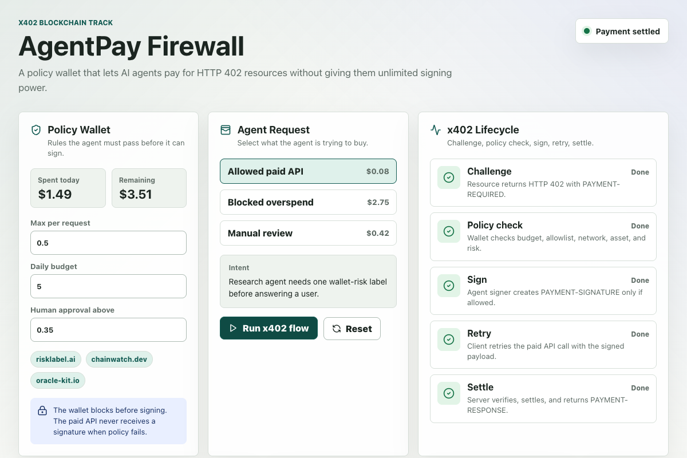
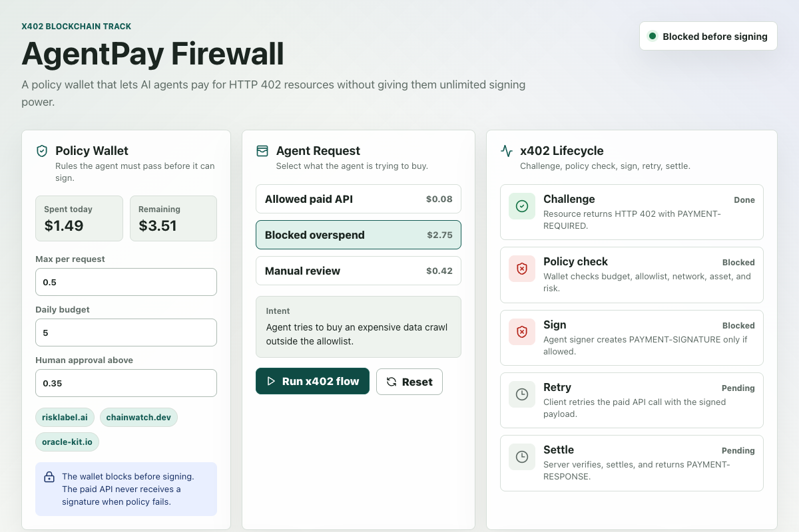

# AgentPay Firewall

AgentPay Firewall is a hackathon MVP for the Brainwave 2026 X402 Blockchain Track and the payment-rail reference implementation behind [AgentSpend Guard](https://github.com/FeeeeelixWong/agent-spend-guard). It focuses on the x402 challenge, signature, retry, and settlement path; AgentSpend Guard builds the broader operator policy and explanation experience on top of that foundation.

It demonstrates a policy wallet for AI agents:

- a resource server returns an HTTP `402` challenge with `PAYMENT-REQUIRED`
- the agent wallet checks budget, allowlist, asset, network, and risk rules
- only approved requests receive a `PAYMENT-SIGNATURE`
- the client retries the paid request
- the resource server verifies the payload and returns `PAYMENT-RESPONSE`
- every approval, block, review, and settlement is shown in the audit log

The public Vercel demo uses live `/api/paid/*` resource routes and a judge-safe demo signer/facilitator so judges can run the full Challenge -> Sign -> Retry -> Settle flow without funding a wallet. The repo also includes an official x402 SDK/facilitator harness and an OKX Wallet browser signer path.

## Live Links

- Public demo: https://agentpay-firewall.vercel.app/
- Demo video with English voiceover: https://agentpay-firewall.vercel.app/agentpay-firewall-demo.mp4
- Static fallback demo: https://feeeeelixwong.github.io/agentpay-firewall/
- Verified x402 settlement: https://sepolia.basescan.org/tx/0x322c19b1bc8e579e687e5cafdf7861ed5ebe47570b03a9ac0576dc128acdc6da
- Settlement evidence JSON: [docs/x402-settlement-evidence.json](docs/x402-settlement-evidence.json)
- Submission notes: [SUBMISSION.md](SUBMISSION.md)
- Devpost project story: [docs/devpost-project-story.md](docs/devpost-project-story.md)
- Production architecture: [ARCHITECTURE.md](ARCHITECTURE.md)
- Demo script: [docs/demo-script.md](docs/demo-script.md)
- Voiceover transcript: [docs/demo-voiceover.txt](docs/demo-voiceover.txt)

## Quick Start

```bash
npm install
npm run dev
```

Open:

```text
http://127.0.0.1:5176
```

The local API runs on:

```text
http://127.0.0.1:8787
```

The deployed Vercel demo includes serverless API routes under `api/`, so judges can try the full x402-style HTTP flow from the public URL.

## Demo Flow

1. Run **Allowed paid API**.
2. The server returns `402 Payment Required` and a `PAYMENT-REQUIRED` header.
3. The policy wallet approves the request because it is allowlisted and under budget.
4. The wallet signs a `PAYMENT-SIGNATURE`.
5. The client retries the request.
6. The server verifies and settles, then returns `PAYMENT-RESPONSE`.
7. Run **Blocked overspend** to show that the wallet refuses before signing.
8. Run **Manual review** to show a human approval path for higher-value requests.

## Why It Matters

AI agents need to pay for APIs, data, tools, and other agents. Raw signing power is too dangerous, and manual approval for every micropayment removes the value of agent autonomy.

AgentPay Firewall inserts a policy layer between the agent and the x402 signer. The agent can act, but only inside a user-defined mandate.

## Project Relationship

This repository preserves the x402-focused hackathon implementation and its settlement evidence. For a broader, hosted product workflow with deterministic spending policy, manual review, and operator-ready explanations, see [AgentSpend Guard](https://github.com/FeeeeelixWong/agent-spend-guard).

## Screenshots





## Built With

- React
- TypeScript
- Vite
- Node.js local HTTP server
- Vercel serverless API routes
- `@x402/express`, `@x402/fetch`, `@x402/evm`, `@x402/core`
- `viem` signer support

## Tests

```bash
npm test
npm run build
npm run smoke
npm run x402:ready
```

`npm run smoke` defaults to the public Vercel deployment and validates the complete hosted flow: `402 -> PAYMENT-REQUIRED -> PAYMENT-SIGNATURE -> paid retry -> PAYMENT-RESPONSE`. Use `BASE_URL=http://127.0.0.1:8787 npm run smoke` while the local API is running.

## Official x402 Harness

The default demo receipt is marked `demo-facilitator` and `onchain: false` so it cannot be confused with a real transaction. To verify the production path with official packages:

```bash
npm run x402:ready
X402_PAY_TO=0xYourReceivingWallet npm run dev:x402
npm run x402:challenge
```

The official harness uses `@x402/express`, `@x402/fetch`, `@x402/evm`, and `@x402/core`. Defaults are Base Sepolia (`eip155:84532`) and `https://x402.org/facilitator`; set `X402_MODE=mainnet`, `X402_NETWORK=eip155:8453`, `X402_FACILITATOR_URL`, and CDP credentials for mainnet/CDP facilitator testing.

For automated CLI regression testing with Base Sepolia, use:

```bash
X402_EVM_PRIVATE_KEY=0xYourFundedBuyerKey npm run x402:pay
```

The package file pins `viem` with an npm `overrides` entry because the current `@x402/evm@2.18.0` peer dependency range points beyond the latest `viem` version available from the registry in this environment.

## OKX Wallet Browser Payment

You can run the official buyer path without exporting a private key:

```bash
X402_PAY_TO=0xYourReceivingWallet npm run dev:x402
npm run dev:web
```

Open `http://127.0.0.1:5176`, use the **Sign x402 with OKX** button, and confirm the typed-data signature in the OKX browser extension. OKX Wallet's documented network list includes Base mainnet (`eip155:8453`) but not Base Sepolia (`eip155:84532`), so the browser path does not force a Base Sepolia chain switch. For the default Base Sepolia testnet challenge, it asks OKX to sign the EIP-712 x402 authorization directly; if your OKX build refuses unknown-chain typed data, verify Base Sepolia with the CLI harness or point `VITE_X402_TARGET_URL` at an OKX-supported mainnet x402 resource.

Verified settlement evidence:

```text
Network: Base Sepolia (eip155:84532)
Payer: 0x0934146ca4f8e611da0ef8bd295ee9f7e34741fe
Pay to: 0x4a6aae28b27681856ae824af82fea87896ecc3ed
Amount: 0.001 USDC
Transaction: https://sepolia.basescan.org/tx/0x322c19b1bc8e579e687e5cafdf7861ed5ebe47570b03a9ac0576dc128acdc6da
```

## License

MIT. See [LICENSE](LICENSE).
