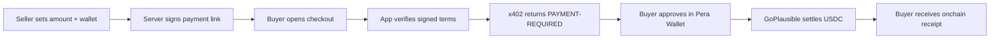

# AgentPay Firewall

Seller-created, buyer-verified x402 payment links for USDC on Algorand.

[Live seller app](https://agentpay-firewall.vercel.app/) | [Buyer checkout](https://agentpay-firewall.vercel.app/pay) | [Verified settlement](https://lora.algokit.io/testnet/transaction/SEQAUK2K5SHHLUA35273OWDNCXXWVODYUUKPZUHQ6JZ2WPQEQWDQ) | [Architecture](ARCHITECTURE.md)

## Product Flow

AgentPay Firewall separates the payment experience into two clear roles:

| Role | What they do | What they control |
| --- | --- | --- |
| Seller | Enters an amount, receiving address, title, and description; then creates a link | Price and settlement wallet |
| Buyer | Opens the link, reviews the signed terms, connects Pera Wallet, and approves payment | Wallet authorization and final consent |


```mermaid
flowchart LR
  S["Seller sets amount + wallet"] --> L["Server signs payment link"]
  L --> B["Buyer opens checkout"]
  B --> V["App verifies signed terms"]
  V --> C["x402 returns PAYMENT-REQUIRED"]
  C --> W["Buyer approves in Pera Wallet"]
  W --> F["GoPlausible settles USDC"]
  F --> R["Buyer receives onchain receipt"]
```

The amount and recipient are not trusted from editable URL parameters. They are encoded in an HMAC-signed, seven-day payment request. The Buyer page also checks that the live x402 challenge exactly matches the signed amount and recipient before opening wallet approval.

## Direct x402 Integration

Every generated checkout points to a dynamic protected resource:

```text
GET /api/x402/pay?request=<signed-token>
<- 402 Payment Required
<- PAYMENT-REQUIRED: <x402 v2 challenge>
```

The implementation uses:

- `@x402/express` payment middleware
- `@x402/core` facilitator client and HTTP protocol types
- `@x402/avm` exact payment scheme
- GoPlausible facilitator
- Algorand Testnet USDC ASA `10458941`

The original fixed-price integration remains available at [`/api/x402/official`](https://agentpay-firewall.vercel.app/api/x402/official) as reproducible final-round evidence. New product checkouts use `/api/x402/pay` and seller-specific signed terms.

## Verifiable Evidence

| Proof | Result |
| --- | --- |
| Official x402 challenge | Live `402` with x402 v2 `PAYMENT-REQUIRED` |
| Real wallet authorization | Pera Wallet signed a request-bound AVM payment |
| Facilitated settlement | GoPlausible settled the atomic transaction group |
| Onchain transaction | [`SEQAUK...QEQWDQ`](https://lora.algokit.io/testnet/transaction/SEQAUK2K5SHHLUA35273OWDNCXXWVODYUUKPZUHQ6JZ2WPQEQWDQ) |
| Buyer and seller | Buyer `25QH...RRBM` paid Seller `U3SN...PQJA` |

Machine-readable evidence is stored in [`docs/algorand-x402-settlement-evidence.json`](docs/algorand-x402-settlement-evidence.json).

## Security Boundary

- Seller terms are normalized and signed on the server.
- Modified or expired links are rejected before an x402 challenge is created.
- The Buyer page compares the signed amount and recipient with the live challenge.
- Buyer keys remain inside Pera Wallet.
- AgentPay never signs, broadcasts, or holds buyer funds.
- GoPlausible verifies and settles through the official x402 AVM path.
- Payment-link APIs are non-cacheable and input bodies are size-limited.

## Local Development

Create a local secret with at least 32 characters:

```bash
export PAYMENT_LINK_SECRET="replace-with-a-long-random-development-secret"
npm install
npm run dev
```

Open `http://127.0.0.1:5176`. The Vite-only server renders the UI; run through Vercel locally or deploy the serverless APIs to create live links.

## Validation

```bash
npm test
npm run build
npm run smoke:x402
npm run smoke:checkout
```

`smoke:checkout` creates a Seller link, validates the Buyer representation, asserts the dynamic `402` amount and recipient, and confirms a modified token is rejected.

## Configuration

| Variable | Purpose |
| --- | --- |
| `PAYMENT_LINK_SECRET` | HMAC secret used to sign and verify checkout terms; required |
| `PUBLIC_APP_URL` | Optional canonical public origin for generated links |
| `ALGORAND_X402_FACILITATOR_URL` | Optional facilitator override |

## Documentation

- [Architecture and trust boundaries](ARCHITECTURE.md)
- [Final-round correction](RESUBMISSION.md)
- [Submission narrative](SUBMISSION.md)
- [Devpost project story](docs/devpost-project-story.md)

## License

MIT. See [LICENSE](LICENSE).
