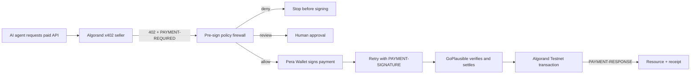

# AgentPay Firewall

Policy-controlled x402 payments for autonomous agents, now running on Algorand Testnet.

[Live app](https://agentpay-firewall.vercel.app/) | [Algorand x402 endpoint](https://agentpay-firewall.vercel.app/api/x402/official) | [Verified settlement](https://lora.algokit.io/testnet/transaction/SEQAUK2K5SHHLUA35273OWDNCXXWVODYUUKPZUHQ6JZ2WPQEQWDQ) | [Source](https://github.com/FeeeeelixWong/agentpay-firewall)

## Final-Round Algorand Integration

The public product directly exposes an x402-protected seller resource on Algorand Testnet:

```text
GET https://agentpay-firewall.vercel.app/api/x402/official
<- 402 Payment Required
<- PAYMENT-REQUIRED: <x402 v2 challenge>
```

The primary route uses:

- `@x402/express` payment middleware
- `@x402/core` facilitator client and HTTP protocol types
- `@x402/avm` exact payment scheme
- GoPlausible facilitator
- Algorand Testnet USDC ASA `10458941`

It is a direct protocol integration, not a custom header approximation. Verify the live challenge without connecting a wallet:

```bash
npm install
npm run smoke:x402
```

Expected result:

```text
Hosted official x402 challenge verified.
Protocol version: 2
Scheme: exact
Network: algorand:SGO1GKSzyE7IEPItTxCByw9x8FmnrCDexi9/cOUJOiI=
Amount: 1000
Pay to: U3SN2UCQENDGE3CHKPBMXRSNJ2GFCCHLBT7NUC46VSPEGZDMOIQNCHPQJA
```

## What The Product Does

x402 lets an agent pay for an internet resource. AgentPay Firewall decides whether that payment fits the owner's mandate before asking the wallet to sign.


```mermaid
flowchart LR
  A["AI agent requests paid API"] --> B["Algorand x402 seller"]
  B -->|"402 + PAYMENT-REQUIRED"| C["Pre-sign policy firewall"]
  C -->|"deny"| D["Stop before signing"]
  C -->|"review"| E["Human approval"]
  C -->|"allow"| F["Pera Wallet signs payment"]
  F --> G["Retry with PAYMENT-SIGNATURE"]
  G --> H["GoPlausible verifies and settles"]
  H --> I["Algorand Testnet transaction"]
  I -->|"PAYMENT-RESPONSE"| J["Resource + receipt"]
```

The policy layer evaluates request amount, daily budget, approved service, network and asset, risk score, and human approval threshold.

## Verifiable Paths

| Path | What it proves | How to verify |
| --- | --- | --- |
| Hosted Algorand x402 | Direct seller integration with `@x402/avm` | Click **Verify official 402** or run `npm run smoke:x402` |
| Pera buyer flow | Wallet-owned Algorand authorization | Connect Pera Wallet and use **Pay 0.001 USDC** |
| Onchain settlement | Buyer-to-Seller USDC transfer with facilitator fee sponsorship | [Inspect transaction `SEQA...QWDQ` in Lora](https://lora.algokit.io/testnet/transaction/SEQAUK2K5SHHLUA35273OWDNCXXWVODYUUKPZUHQ6JZ2WPQEQWDQ) |
| Policy scenarios | Allow, deny, and manual-review outcomes before signing | Run the three deterministic scenarios in the app |
| Base compatibility | The policy product can preserve a previous EVM integration | Inspect `/api/x402/base` and the archived Base evidence |

The `/api/paid/*` routes are clearly labeled simulations for deterministic policy demonstrations. `/api/x402/official` is the final-round Algorand x402 route.

## Live Configuration

```text
Protocol: x402 v2
Scheme: exact
Network: Algorand Testnet
Asset: USDC ASA 10458941
Price: 0.001 USDC (1000 atomic units)
Facilitator: https://facilitator.goplausible.xyz
Seller: U3SN2UCQENDGE3CHKPBMXRSNJ2GFCCHLBT7NUC46VSPEGZDMOIQNCHPQJA
```

## Settlement Status

- Live Algorand `402 -> PAYMENT-REQUIRED`: verified.
- GoPlausible support for the registered AVM scheme: verified.
- Pera Wallet buyer signed the request-bound payment.
- GoPlausible settled an atomic two-transaction group at round `66373009`.
- Buyer `25QH...RRBM` paid `0.001 USDC` to Seller `U3SN...PQJA`.
- The facilitator fee payer covered `0.002 ALGO`; the USDC transfer itself paid zero fee.
- Transaction: [`SEQAUK2K5SHHLUA35273OWDNCXXWVODYUUKPZUHQ6JZ2WPQEQWDQ`](https://lora.algokit.io/testnet/transaction/SEQAUK2K5SHHLUA35273OWDNCXXWVODYUUKPZUHQ6JZ2WPQEQWDQ).
- Machine-readable evidence: [`docs/algorand-x402-settlement-evidence.json`](docs/algorand-x402-settlement-evidence.json).

The earlier Base Sepolia receipt remains available as portability evidence at [docs/x402-settlement-evidence.json](docs/x402-settlement-evidence.json), but it is not presented as the required Algorand final-round transaction.

## Local Development

```bash
npm install
npm run dev
```

Open `http://127.0.0.1:5176`.

Run the Algorand seller harness and challenge verifier:

```bash
npm run dev:x402
npm run x402:challenge
```

The default Seller is the public Testnet address above. Override it with `ALGORAND_PAY_TO` when needed.

For a local automated buyer, keep credentials only in the shell environment:

```bash
ALGORAND_BUYER_MNEMONIC="..." npm run x402:pay
```

Never commit a mnemonic or private key. The browser path keeps signing inside Pera Wallet.

## Validation

```bash
npm test
npm run build
npm run x402:ready
npm run smoke:x402
```

## Documentation

- [Final-round correction](RESUBMISSION.md)
- [Architecture and trust boundaries](ARCHITECTURE.md)
- [Submission narrative](SUBMISSION.md)
- [Devpost project story](docs/devpost-project-story.md)

## License

MIT. See [LICENSE](LICENSE).
