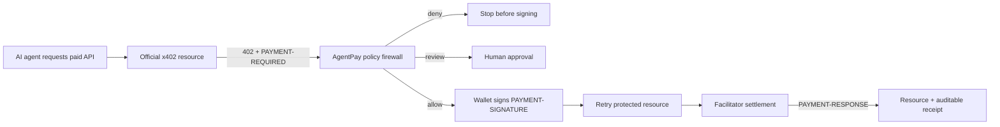

# AgentPay Firewall

Policy-controlled x402 payments for autonomous agents.

[Live app](https://agentpay-firewall.vercel.app/) | [Official x402 endpoint](https://agentpay-firewall.vercel.app/api/x402/official) | [Verified settlement](https://sepolia.basescan.org/tx/0x322c19b1bc8e579e687e5cafdf7861ed5ebe47570b03a9ac0576dc128acdc6da) | [Demo video](https://agentpay-firewall.vercel.app/agentpay-firewall-demo.mp4)

## Brainwave Resubmission Correction

The public product now directly exposes an official x402-protected resource:

```text
GET https://agentpay-firewall.vercel.app/api/x402/official
<- 402 Payment Required
<- PAYMENT-REQUIRED: <x402 v2 challenge>
```

This route is protected by `@x402/express` `paymentMiddleware`, uses the `exact` EVM scheme from `@x402/evm`, and is connected to the public x402.org facilitator on Base Sepolia. It is not an x404 implementation or a custom header approximation.

Verify the live protocol challenge without a wallet:

```bash
npm install
npm run smoke:x402
```

Expected result:

```text
Hosted official x402 challenge verified.
Protocol version: 2
Scheme: exact
Network: eip155:84532
Amount: 1000
Pay to: 0x4a6aae28b27681856ae824af82fea87896ecc3ed
```

## What The Product Does

x402 lets an agent pay for an internet resource. AgentPay Firewall decides whether the agent should be allowed to pay.


```mermaid
flowchart LR
  A["AI agent requests paid API"] --> B["Official x402 resource"]
  B -->|"402 + PAYMENT-REQUIRED"| C["AgentPay policy firewall"]
  C -->|"deny"| D["Stop before signing"]
  C -->|"review"| E["Human approval"]
  C -->|"allow"| F["Wallet signs PAYMENT-SIGNATURE"]
  F --> G["Retry protected resource"]
  G --> H["Facilitator settlement"]
  H -->|"PAYMENT-RESPONSE"| I["Resource + auditable receipt"]
```

Before signing, the policy layer evaluates:

- maximum amount per request
- daily spending budget
- approved services
- network and asset
- risk score
- human approval threshold

## Three Verifiable Paths

| Path | What it proves | How to verify |
| --- | --- | --- |
| Hosted official x402 | Direct standards-compliant seller integration | Open the app and click **Verify official 402**, or run `npm run smoke:x402` |
| Policy scenarios | Allow, deny, and manual-review decisions before signing | Run the three scenarios in the live app |
| Real settlement | Wallet authorization, facilitator settlement, and onchain receipt | Inspect the [Base Sepolia transaction](https://sepolia.basescan.org/tx/0x322c19b1bc8e579e687e5cafdf7861ed5ebe47570b03a9ac0576dc128acdc6da) |

The `/api/paid/*` routes are deterministic policy simulations for judge-friendly allow, deny, and review testing. The `/api/x402/official` route is the direct official x402 integration and is visually separated in the product.

## Live Configuration

```text
Protocol: x402 v2
Scheme: exact
Network: Base Sepolia (eip155:84532)
Price: 0.001 USDC
Facilitator: https://x402.org/facilitator
Pay to: 0x4a6aae28b27681856ae824af82fea87896ecc3ed
```

Official packages:

- `@x402/express`
- `@x402/core`
- `@x402/evm`
- `@x402/fetch`

## Verified Settlement

```text
Status: settled
Payer: 0x0934146ca4f8e611da0ef8bd295ee9f7e34741fe
Pay to: 0x4a6aae28b27681856ae824af82fea87896ecc3ed
Amount: 0.001 USDC
Transaction: 0x322c19b1bc8e579e687e5cafdf7861ed5ebe47570b03a9ac0576dc128acdc6da
```

The buyer signed the request-bound EIP-712 payment authorization with OKX Wallet. The x402 facilitator submitted the gasless USDC settlement. Machine-readable evidence is stored in [docs/x402-settlement-evidence.json](docs/x402-settlement-evidence.json).

## Local Development

```bash
npm install
npm run dev
```

Open `http://127.0.0.1:5176`.

Run the local official x402 seller separately when testing the server harness:

```bash
X402_PAY_TO=0xYourReceivingWallet npm run dev:x402
npm run x402:challenge
```

For an automated funded buyer test:

```bash
X402_EVM_PRIVATE_KEY=0xYourFundedBuyerKey npm run x402:pay
```

The browser buyer never exports the private key. It requests `eth_signTypedData_v4` from OKX Wallet, sends the encoded `PAYMENT-SIGNATURE`, and decodes the facilitator's `PAYMENT-RESPONSE`.

## Validation

```bash
npm test
npm run build
npm run smoke:x402
npm run smoke
```

- `smoke:x402` validates the live official challenge and resource binding.
- `smoke` validates the hosted policy lifecycle: `402 -> sign -> retry -> PAYMENT-RESPONSE`.

## Documentation

- [Resubmission proof](RESUBMISSION.md)
- [Architecture and trust boundaries](ARCHITECTURE.md)
- [Brainwave submission narrative](SUBMISSION.md)
- [Devpost project story](docs/devpost-project-story.md)
- [Demo script](docs/demo-script.md)

## License

MIT. See [LICENSE](LICENSE).
